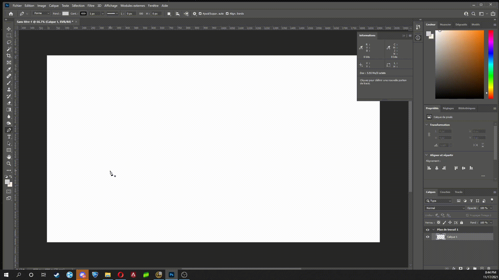

# le Vectoriel

## 1. La plume
Dans photoshop, vous pouvez realiser du vectoriel grace a plusieurs techniques. La principale techniques est la plume. Pour acceder a la plume, vous pouvez appuyer sur "p" ou allez chercher l'icone ci-dessous

 

la premiere utiliter de la plume est de faire des formes. Voici un exemple:

Ensuite, vous pouver arrondire les coins avec alt ou en selectionant l'icone ci-dessous ou en fesant un "right click" sur l'icone de la plume pour le trouver.

 

De plus, en apuyant sur alt 

