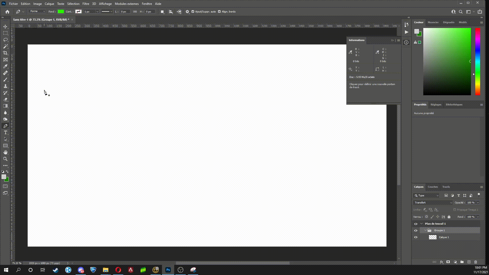
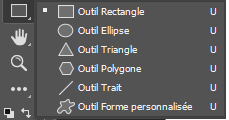
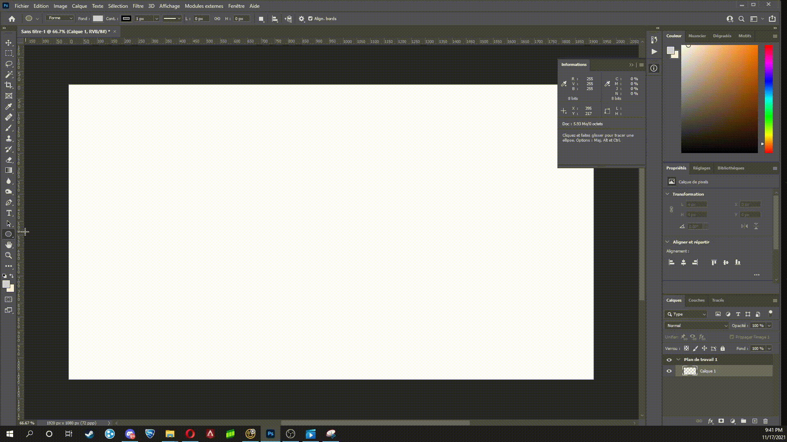

# le Vectoriel

## 1. La plume
Dans Photoshop, vous pouvez réaliser du vectoriel grace à plusieurs techniques. La principale technique est la plume. Pour accéder à la plume, vous pouvez appuyer sur le "p" ou allez chercher l'icône ci-dessous. De plus, la section en haut à gauche devrait être écrite "forme" et non tracé.

 

la première utilité de la plume est de faire des formes. Voici un exemple:

Ensuite, vous pouvez arrondir les coins avec "alt" en sélectionnant l'icône ci-dessous ou en faisant un "right click" sur l'icône de la plume pour le trouver.

 

De plus, en appuyant sur alt sur une des lignes de courbure, vous pouvez les bouger individuellement.

## 2. les formes
D'autres outils essentiels sont les formes. Vous avez une multiple variété de formes en faisant un "right click" sur l'outil de formes ci-dessous.
De plus, en clickant sur "shift", vous pouvez faire des formes parfaites.

## 3. Exemple

voici ce que vous pourriez faire avec uniquement ces deux outils.

